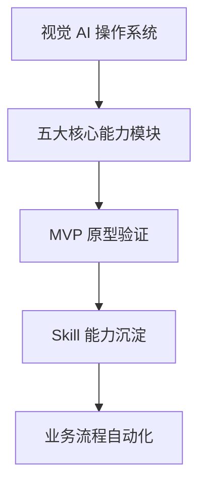
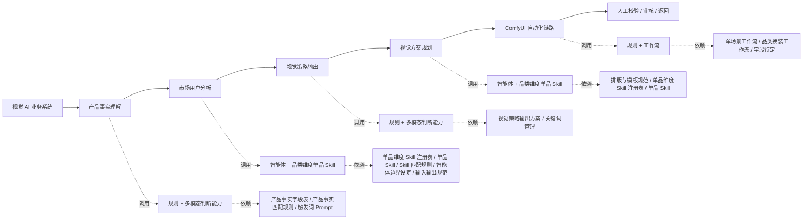
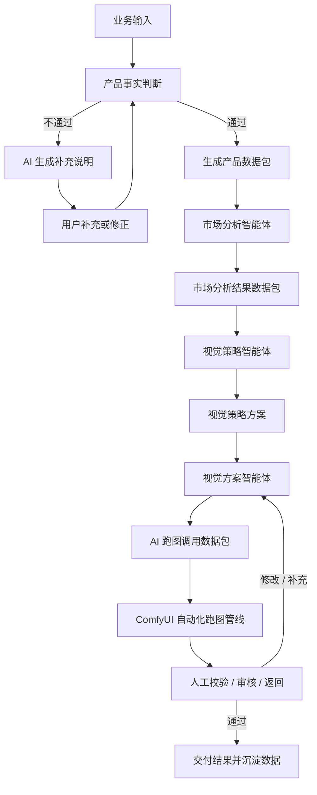
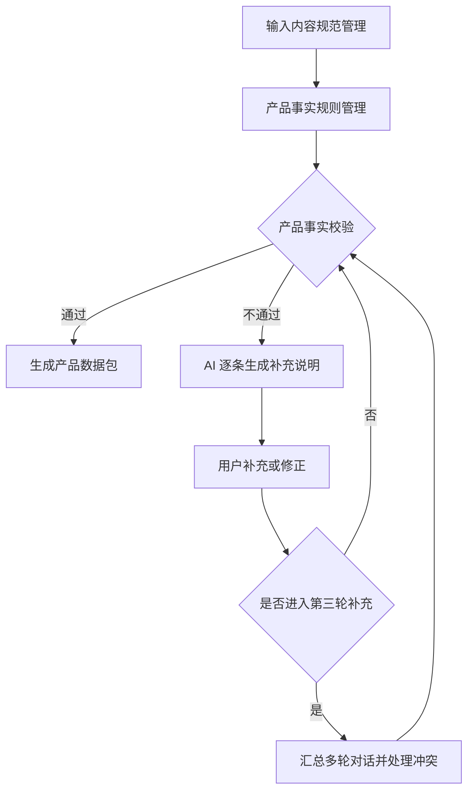
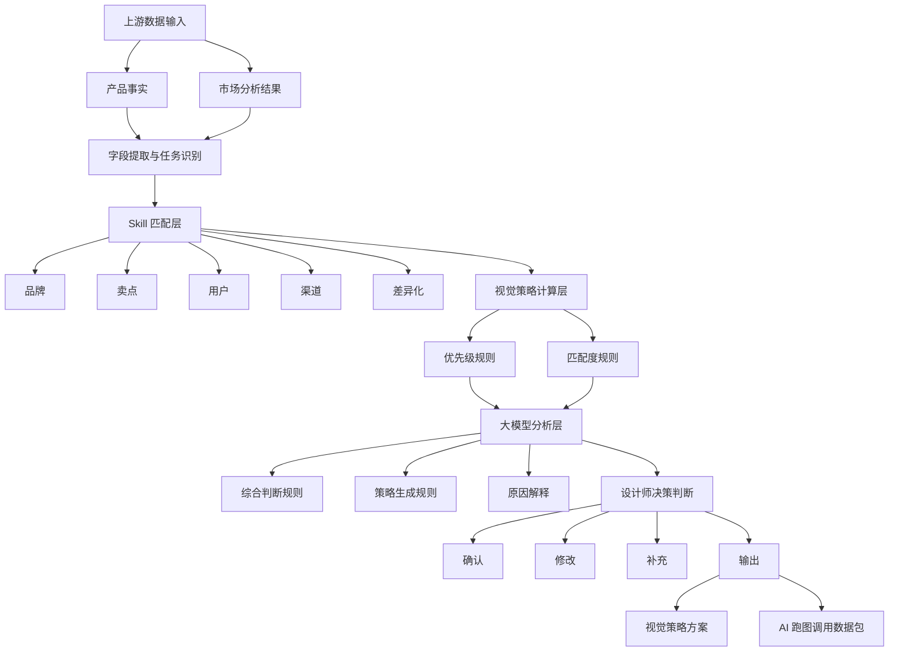
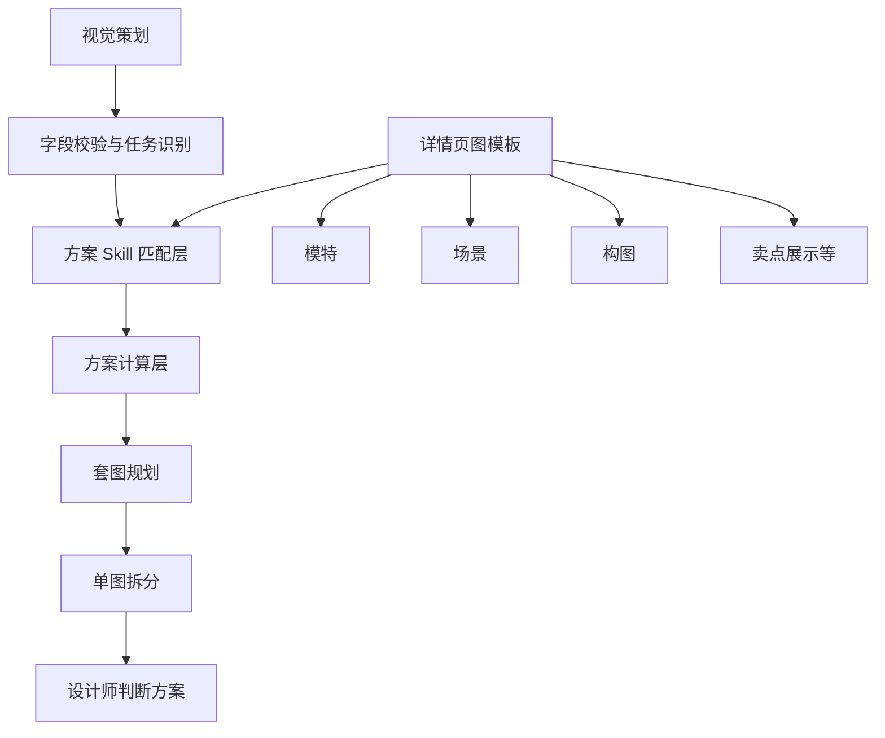
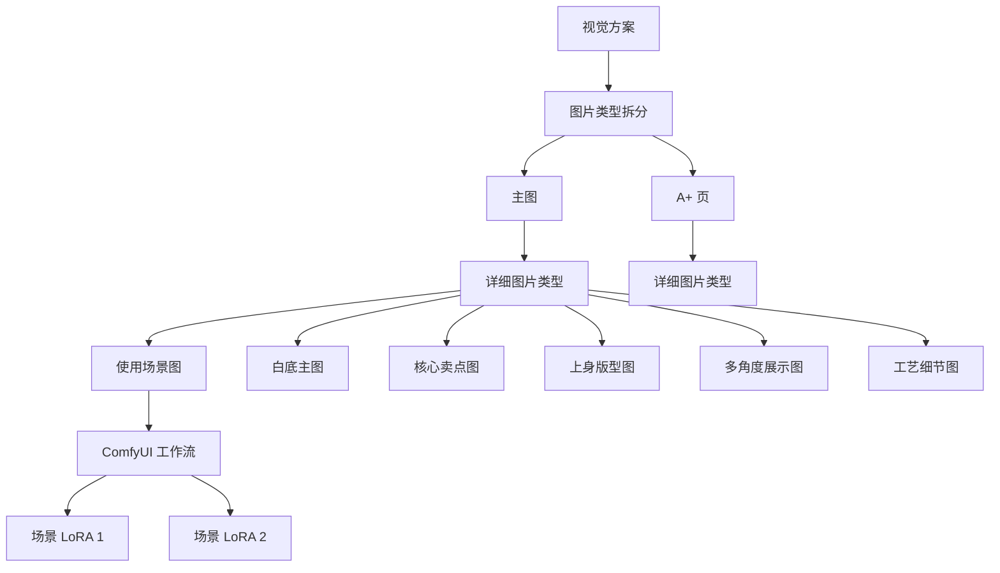

# 视觉跑图 AI 流程：AI 可读版

> 来源文档：`C:\Users\Administrator\Downloads\视觉跑图AI流程 (1).docx`
>
> 转换目标：将原始方案整理为 AI 代理可读取、可拆解、可执行、可校验的 Markdown 结构。图片流程图已转写为 Mermaid 和规则表；无法从图片中稳定确认的细节列入「待确认项」。

## 1. 文档目标

本流程用于建设「视觉 AI 操作系统」，把视觉跑图从经验驱动的人工流程，转为由标准数据、规则、Skill、工作流和人工审核共同组成的 AI 生产流程。

核心目标包括：

- 建立产品事实、市场分析、视觉策略、视觉方案、ComfyUI 跑图和人工审核之间的稳定链路。
- 将产品事实、市场结论、视觉策略和图片任务拆成标准数据包。
- 通过 Skill 沉淀设计师经验，并让 AI 按规则调用。
- 通过数据库动态更新，让流程快速迭代出多条思维链路。
- 在 AI 不确定、信息缺失、事实冲突或合规风险出现时，触发人工确认。

## 2. 总体逻辑树



> 待确认：原文第 1.2 节标题为「六大核心能力模块」，但图中核心能力层实际展示为 5 个 AI 能力模块，并在末端接入「人工校验 / 审核 / 返回」。需要确认「人工校验」是否被计入第 6 个核心能力模块。

## 3. 核心能力架构



数据库来源原则：

- 数据库需要动态更新。
- 核心价值是快速迭代多条思维链路。
- 每个模块都应记录输入、输出、规则版本、调用的 Skill、判断结果和人工确认状态。

## 4. 端到端业务流程



## 5. 模块规格总览

| 模块 | 输入 | AI 动作 | 输出 | 人工确认点 |
| --- | --- | --- | --- | --- |
| 产品事实判断规则 | 用户输入、产品资料、图片、表格、品牌资料 | 校验字段完整性、有效性、真实性和冲突 | 产品数据包或补充说明 | 信息缺失、事实冲突、超过 3 轮补充、禁止推断项 |
| 市场分析智能体 | 产品事实表、品类、单品、竞品、用户和渠道信息 | 做市场用户、品类、单品、竞品分析 | 市场分析结果、市场分析数据包 | 分析结论是否能用于设计经验沉淀 |
| 视觉策略智能体 | 产品事实数据包、市场分析结果、竞品结论、品牌规范、渠道任务 | 判断向谁表达、表达什么、优先级、视觉方向和差异化 | 视觉策略方案、AI 跑图调用数据包 | 硬规则、未经确认卖点、产品结构和品牌禁用项 |
| 视觉方案智能体 | 视觉策略方案、渠道任务、图片类型、模板规范 | 拆分图片类型、匹配方案 Skill、计算方案和套图规划 | 单图任务、套图计划、设计师判断方案 | 图片类型、模板、场景、构图和卖点表达确认 |
| ComfyUI 自动化跑图管线 | AI 跑图调用数据包、Workflow、Prompt、素材、模型 | 根据任务类型调用工作流生成图片 | 候选图、生成记录、失败原因 | 产品结构、Logo、颜色、材质、平台规则、AI 瑕疵 |
| 数据库管理 | 各模块输入输出、版本、规则、工作流、Prompt、案例 | 保存、索引、更新、回滚 | 产品事实库、工作流库、竞品库、Skill 库 | 版本发布、字段变更、规则废弃 |

## 6. 产品事实判断规则

### 6.1 职责

产品事实判断规则负责把用户提交的产品资料转成后续 AI 可调用的「产品数据包」。该模块只处理事实校验和数据结构化，不负责市场判断、视觉策略和跑图生成。

### 6.2 输入内容规范管理

智能体搭建阶段需要定义：

- 输入资料来源范围。
- 各来源的可信度与优先级。
- 各业务流程所需的输入内容。
- 必填字段与选填字段。
- 字段名称、格式及填写标准。
- 文本、图片、表格等文件要求。
- 不同品牌、品类的字段差异。
- 输入资料更新与版本管理方式。

### 6.3 产品事实规则管理

根据以下内容建立产品事实校验规则：

- 输入内容规范。
- 全流程数据需求。
- 结构化输出要求。
- 字段完整性与有效性要求。

智能体搭建阶段需要补充：

- 字段完整性判断规则。
- 字段格式正确性规则。
- 内容真实性判断依据。
- 不同资料之间的一致性规则。
- 信息冲突时的处理优先级。
- 模糊描述的识别标准。
- 异常数据的识别规则。
- AI 允许推断与禁止推断的范围。
- 必须转人工确认的情况。
- 「通过 / 不通过 / 有条件通过」的判断标准。

### 6.4 字段提取规则

搭建阶段需要定义：

- 从产品数据包提取哪些产品事实。
- 从市场分析数据包提取哪些用户结论。
- 从竞品报告提取哪些视觉特征。
- 从品牌手册提取哪些硬性规范。
- 从业务需求中提取哪些渠道与交付要求。
- 同一字段存在多个结论时的优先级。
- 事实字段与 AI 推断字段的标记方式。
- 信息缺失时是否允许继续生成策略。
- 哪些字段必须由设计师确认。
- 视觉策略字段如何传递给下游智能体。

### 6.5 执行流程



### 6.6 通过规则

| 判断结果 | 状态 | AI 动作 | 输出 | 下一节点 |
| --- | --- | --- | --- | --- |
| 校验通过 | 通过 | 生成标准化产品数据包 | 产品数据包 | 进入后续业务流程 |
| 校验不通过 | 待补充 | 逐条列举缺失、错误或冲突信息 | 补充说明 | 退回用户补充或修正 |
| 多轮补充后仍冲突 | 待确认 | 汇总第 1 至 3 轮有效信息，清理重复或无效内容 | 冲突字段清单 | 回滚至对应字段重新确认 |

### 6.7 补充追问规则

智能体搭建阶段需要补充：

- 哪些字段缺失时必须追问。
- 哪些非关键字段可以暂时跳过。
- 不同缺失字段对应的追问内容。
- 每轮追问的字段数量与优先级。
- 追问问题的标准表达模板。
- 是否需要提供填写示例。
- 用户重复提交无效信息时的处理方式。
- 最多允许的补充对话轮次。

### 6.8 输出数据包要求

产品数据包需要包含：

- 产品事实字段结构。
- 各字段的数据格式。
- 已确认字段与待确认字段。
- 字段来源与更新时间。
- 禁止修改项。
- 风险项。
- 下游智能体调用接口规范。
- 数据包命名、版本和更新规则。

## 7. 市场分析智能体

### 7.1 职责

市场分析智能体承接产品事实表，完成市场用户、品类、单品、竞品等维度分析，输出可被视觉策略智能体调用的市场分析结果。

### 7.2 执行流程

```mermaid
flowchart TD
  A[产品事实表.md] -->|字段筛选规则| B[产品信息字段]
  B --> C[数据标准化层]
  C --> C1[市场用户分析]
  C --> C2[品类维度分析]
  C --> C3[单品分析]
  C --> C4[竞品分析]
  C --> D[市场分析智能体]
  D --> E[输出]
  E --> F{结果是否通过}
  F -->|通过| G[多维度规则]
  G --> H[设计师经验沉淀]
  F -->|通过| I[市场分析结果数据包]
  I --> J[后续智能体判断数据包]
  E --> K[市场分析结果]
  K --> L[产出给用户看的结论]
```



### 7.3 字段架构

| 层级 | 需要定义的内容 |
| --- | --- |
| 字段层 | 市场分析所需字段、字段来源及优先级、字段提取方法、字段标准化规则、缺失与冲突处理规则 |
| Skill 层 | 品类分析方法、单品分析方法、用户需求分析方法、价格带分析方法、趋势分析方法、渠道分析方法、各 Skill 标准输出模板 |
| 竞品层 | 竞品分类标准、竞品筛选规则、产品拆解方法、视觉拆解方法、竞品评分规则、竞品分析标准模板 |
| 计算层 | 核心指标定义、数据计算方法、指标权重、分数分级标准、数据不足时的处理规则、权重迭代与校准方式 |
| 大模型层 | 综合分析方法、事实引用规则、结论生成规则、置信度规则、AI 推断边界、人工确认条件、结果字段与输出格式 |

### 7.4 智能体边界

| 智能体 / Skill | 负责什么 | 不负责什么 | 核心输出 |
| --- | --- | --- | --- |
| 市场用户分析 Skill | 识别目标用户、购买场景、购买阻力、情绪诉求 | 不直接决定视觉风格 | 用户分层、购买问题清单、需求结论 |
| 品类维度 Skill | 判断品类趋势、价格带、竞争密度、视觉惯例 | 不评价单个 SKU 的细节 | 品类机会、品类视觉范式、品类风险 |
| 单品 Skill | 分析具体商品的卖点、差异化、转化阻力 | 不泛化整个市场 | 单品卖点优先级、适配人群、建议 |
| 竞品分析 Skill | 拆竞品视觉结构、卖点图文、评价、销量信号 | 不直接生成最终结论 | 竞品矩阵、视觉策略对比、空白位置 |
| Skill 匹配 Agent | 根据输入任务选择调用哪些 Skill | 不做业务判断 | Skill 路由结果、置信度、缺失项 |
| 市场机会判断 Agent | 汇总问题与机会，判断是否值得投入 | 不直接排期或定价 | 明确市场机会、优先级、验证路径 |

## 8. 视觉策略智能体

### 8.1 职责

视觉策略智能体承接以下输入：

- 产品事实数据包。
- 市场用户分析结果。
- 竞品分析结果。
- 品牌视觉规范。
- 渠道与业务任务。

它需要结合视觉策划方法和设计师经验，判断产品应该：

- 向谁表达。
- 表达什么。
- 按什么优先级表达。
- 采用什么视觉方向。
- 如何与竞品形成差异。
- 如何转化为后续可执行的视觉方案。

### 8.2 最终需要回答的问题

- 这个产品最应该向谁表达？
- 用户为什么会购买这个产品？
- 用户购买前最大的顾虑是什么？
- 产品最值得优先表达的卖点是什么？
- 哪些卖点能够通过图片直接证明？
- 竞品正在采用什么视觉方式？
- 本产品应该参考什么、避开什么？
- 本产品可以占据什么差异化视觉位置？
- 不同渠道应该如何调整视觉重点？
- 后续需要生成哪些类型的图片？

### 8.3 数据架构



### 8.4 硬规则

以下规则必须遵守：

- 产品结构不得被错误修改。
- 产品颜色、图案、Logo 不得随意变化。
- 品牌禁用项不得出现。
- 渠道合规要求不得违反。
- 无事实依据的功能不得被视觉化。
- 未经确认的产品卖点不得作为核心策略。

### 8.5 规则强度

原文提出「考虑是否增加权重设计」。建议将规则分为以下强度：

| 规则类型 | 含义 | AI 处理方式 |
| --- | --- | --- |
| 硬规则 | 必须遵守，违反即失败 | 阻断输出，进入人工确认或回滚 |
| 强约束 | 默认遵守，除非人工批准豁免 | 输出时标记风险与理由 |
| 软偏好 | 用于排序和推荐 | 可根据上下文调整 |
| 参考项 | 仅作为启发 | 不作为判断依据 |

## 9. 视觉方案智能体

### 9.1 职责

视觉方案智能体负责解决「具体制作哪些图片、怎么排版、如何呈现」。它不负责重新判断产品事实或市场定位。

### 9.2 执行流程



### 9.3 图片类型拆分



> 待确认：原图底部标注「不展开了，需要根据确认后的视觉策略调整一个版本」。因此该流程只能作为初版框架，不能作为最终固定规则。

### 9.4 单图任务单建议字段

| 字段 | 说明 |
| --- | --- |
| 图片位置 | 主图、副图、A+ 页、广告图等 |
| 图片类型 | 白底主图、场景图、核心卖点图、工艺细节图等 |
| 任务目标 | 该图解决的购买问题 |
| 产品证据 | 支撑该图表达的产品事实 |
| 视觉表达 | 场景、构图、模特、姿态、光影、卖点呈现方式 |
| 禁止项 | 不得改变的产品结构、Logo、颜色、图案、功能表达等 |
| 素材要求 | 需要的原图、参考图、模特、背景、工作流、模型 |
| 验收标准 | 事实准确、品牌一致、平台合规、手机端可读、无明显 AI 瑕疵 |
| 输出格式 | 图片尺寸、文件命名、版本号、交付目录 |

## 10. ComfyUI 自动化跑图管线

### 10.1 职责

ComfyUI 自动化跑图管线负责按照视觉方案和任务单调用工作流，批量生成候选图片，并记录参数、版本、失败原因和人工审核结果。

### 10.2 输入

- 产品结构。
- 材质。
- Logo。
- 颜色。
- 品牌一致性要求。
- 构图要求。
- 信息表达要求。
- 平台尺寸与规则。
- 手机端展示要求。
- 使用图片。
- Workflow。
- Prompt。

### 10.3 输出

| 结果 | 输出内容 |
| --- | --- |
| 成功 | 通过图片、生成记录、Workflow、Prompt、参数、版本 |
| 失败 | 被拒原因、错误类型、失败样本、需要修正的字段或规则 |

### 10.4 工作流类型

| 类型 | 能力 |
| --- | --- |
| 商品图类 | 白底图、抠图、清晰化、放大 |
| 场景图类 | 场景替换、模特生成、姿态调整 |
| 优化类 | 局部修复、材质增强、光影调整 |

## 11. 数据库管理

### 11.1 产品事实字段数据库

需要管理：

- 字段名称。
- 字段来源。
- 批准人。
- 更新时间。
- 冲突处理规则。
- 禁止修改项。
- 风险项。
- 下游调用方式。

格式建议优先使用 `.md` 或 `.csv`。

### 11.2 ComfyUI 工作流数据库

需要管理：

- Workflow 名称。
- 适用图片类型。
- 适用品类。
- 输入字段。
- 输出字段。
- Prompt 模板。
- 模型与 LoRA。
- 参数版本。
- 成功样本。
- 失败样本。
- 回滚版本。

### 11.3 竞品数据库

需要管理：

- 竞品来源。
- 品类。
- 单品。
- 渠道。
- 价格带。
- 视觉结构。
- 卖点表达。
- 用户评价。
- 转化或广告信号。
- 更新时间。

## 12. Skill 架构

### 12.1 文件结构

```text
skill-name/
├── SKILL.md
├── scripts/
├── references/
├── resources/
└── examples/
```

### 12.2 文件职责

| 路径 | 职责 |
| --- | --- |
| `SKILL.md` | 只保留核心内容：触发条件、职责边界、输入输出、执行步骤、异常处理、验收指标 |
| `scripts/` | 固定计算、数据清洗、批量处理、校验等可执行脚本 |
| `references/` | 详细规则、字段字典、案例库、品牌规范等，按需加载 |
| `resources/` | Prompt 模板、输出模板、检查清单、表单等资源 |
| `examples/` | 标准输入输出示例、正反案例 |

### 12.3 单个 Skill 标准模板

```markdown
# Skill 名称

## 1. 适用场景

- 解决什么问题：
- 触发关键词或任务类型：
- 不适用场景：
- 上游 Skill：
- 下游 Skill：

## 2. 职责边界

- 本 Skill 负责：
- 本 Skill 不负责：
- 需要人工确认的内容：

## 3. 输入接口

- 输入字段：
- 数据来源：
- 必填字段：
- 格式要求：
- 缺失字段处理方式：

## 4. 输出接口

- 输出字段：
- 输出格式：
- 输出使用方：
- 是否需要人工审核：

## 5. 执行流程

1. 输入完整性检查。
2. 调用判断规则。
3. 生成初步结果。
4. 自检与冲突检查。
5. 输出结果或触发异常处理。

## 6. 判断规则

- 核心判断条件：
- 优先级规则：
- 禁止推断内容：
- 冲突处理规则：

## 7. 异常处理

- 信息缺失：
- 信息冲突：
- 置信度不足：
- 超出职责范围：
- 转人工条件：

## 8. 评估指标

- 跑通率：
- 一次通过率：
- 平均返工次数：
- 人工修改率：
- 平均处理时长：
- 用户 / 设计师采纳率：

## 9. 迭代记录

- 高频失败原因：
- 新增规则：
- 废弃规则：
- 优秀案例沉淀：
```

## 13. 异常处理总规则

| 异常类型 | 触发条件 | AI 动作 | 下一步 |
| --- | --- | --- | --- |
| 信息缺失 | 必填字段为空、资料来源缺失 | 生成补充说明并按优先级追问 | 用户补充后重新校验 |
| 信息冲突 | 多来源字段不一致 | 标记冲突字段、列出来源、按优先级建议处理 | 回滚到对应字段人工确认 |
| 置信度不足 | AI 推断依据不足 | 输出不确定项，不进入下游关键流程 | 人工确认或补充数据 |
| 违反硬规则 | 改变产品结构、Logo、颜色、品牌禁用项、平台规则等 | 阻断输出 | 返回上游修改 |
| 超出职责范围 | 当前智能体试图处理不属于本模块的任务 | 停止处理并路由到对应模块 | 调用下游或上游智能体 |
| 超过补充轮次 | 产品事实补充超过 3 轮仍未通过 | 汇总多轮记录和冲突点 | 转人工处理 |

## 14. 验收标准

### 14.1 数据验收

- 产品事实字段完整。
- 字段来源、批准人和更新时间可追溯。
- 事实字段与 AI 推断字段已区分。
- 冲突字段已处理或标记为待确认。
- 下游智能体所需字段已覆盖。

### 14.2 策略验收

- 明确目标用户。
- 明确购买问题。
- 明确核心卖点和优先级。
- 每个卖点有产品事实或市场证据支撑。
- 明确参考什么、避开什么。
- 明确渠道差异。

### 14.3 图片任务验收

- 每张图有独立任务目标。
- 每张图绑定产品证据。
- 每张图有素材要求和禁止项。
- 每张图有可检查的验收标准。
- 图片类型、尺寸、命名和版本规则明确。

### 14.4 跑图验收

- 产品结构、颜色、图案、Logo 未被错误修改。
- 材质表达与产品事实一致。
- 图片符合平台规则。
- 手机端阅读清晰。
- 无明显 AI 瑕疵。
- Workflow、Prompt、模型、参数和版本已记录。

### 14.5 流程验收

- 每个模块有输入、输出和责任边界。
- 每个判断节点有通过、不通过和转人工规则。
- 每个数据包有版本记录。
- 每次失败有原因和样本沉淀。
- 可以回滚到上一版本。

## 15. 待确认项

| 级别 | 位置 | 问题 | 对 AI 执行的影响 | 建议补充 |
| --- | --- | --- | --- | --- |
| 阻塞级 | 1.2 视觉 AI 系统六大核心能力模块 | 标题写「六大」，图中仅明确 5 个 AI 能力模块，人工审核是否算第 6 个模块不清楚 | AI 拆模块时可能遗漏或重复定义人工审核模块 | 明确第 6 个模块名称、职责、输入输出 |
| 阻塞级 | 产品事实字段数据库 | 原文仅写「暂放 数据需求」和「只列举需要字段」，字段表未完整定义 | 产品事实判断智能体无法稳定校验和生成数据包 | 补充字段字典、必填项、来源、批准人、更新时间、冲突处理 |
| 阻塞级 | 视觉策略输出格式 | 原文写「输出格式未定」 | 下游视觉方案智能体无法稳定调用 | 定义视觉策略方案的 JSON / Markdown 字段结构 |
| 风险级 | 市场分析智能体 | 权重设计、评分规则、数据不足处理规则未定 | 不同运行结果可能不一致 | 定义指标权重、分级标准、置信度规则 |
| 风险级 | 视觉方案智能体 | 详情页图模板、图片类型和 ComfyUI 工作流未完全展开 | AI 无法自动匹配最终工作流 | 按主图、副图、A+ 页分别补充模板和任务单样例 |
| 风险级 | ComfyUI 管线 | 单场景工作流和品类换装工作流字段未定 | 跑图参数无法复用或追溯 | 补充 Workflow 注册表字段 |
| 优化级 | 文档命名 | 第 3 节和第 4 节都出现「视觉方案智能体」标题，但上下文分别指向策略和方案 | AI 解析章节时容易混淆 | 将第 3 节命名为「视觉策略智能体」，第 4 节保留「视觉方案智能体」 |
| 优化级 | 图中表述 | 存在「Comfyui」「ComfyUI」「skill」「Skill」混用 | 影响机器检索和术语一致性 | 正文统一为「ComfyUI」和「Skill」 |

## 16. 建议拆分的 Skill

| Skill 名称 | 触发任务 | 上游 | 下游 | 主要输出 |
| --- | --- | --- | --- | --- |
| 产品事实校验 Skill | 校验产品资料是否完整、真实、一致 | 用户输入、产品资料 | 市场分析 Skill、视觉策略 Skill | 产品数据包 |
| 市场用户分析 Skill | 分析目标用户、购买问题、市场机会 | 产品数据包 | 视觉策略 Skill | 市场分析结果数据包 |
| 竞品视觉拆解 Skill | 拆解竞品图片结构、卖点和表达方式 | 竞品资料 | 市场分析 Skill、视觉策略 Skill | 竞品视觉分析报告 |
| 视觉策略生成 Skill | 输出目标用户、卖点优先级和视觉方向 | 产品数据包、市场分析结果 | 视觉方案 Skill | 视觉策略方案 |
| 视觉方案规划 Skill | 拆主图、副图、A+ 页和单图任务 | 视觉策略方案 | ComfyUI 调度 Skill | 单图任务单、套图计划 |
| ComfyUI 工作流匹配 Skill | 根据图片任务选择工作流和参数 | 单图任务单 | 跑图执行模块 | AI 跑图调用数据包 |
| 图片质量审核 Skill | 检查事实、品牌、平台、手机端和 AI 瑕疵 | 候选图片、任务单 | 人工审核、数据沉淀 | 审核结果、失败原因 |

## 17. 下一步补充优先级

1. 先补齐产品事实字段表。
2. 再定义视觉策略方案输出格式。
3. 再定义视觉方案任务单字段和图片类型模板。
4. 再补充 ComfyUI Workflow 注册表字段。
5. 最后把每个模块拆成独立 Skill，并提供标准输入输出示例。
