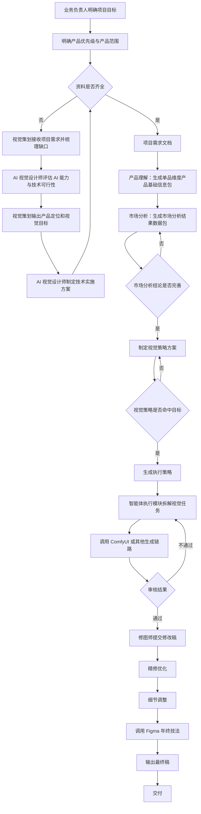
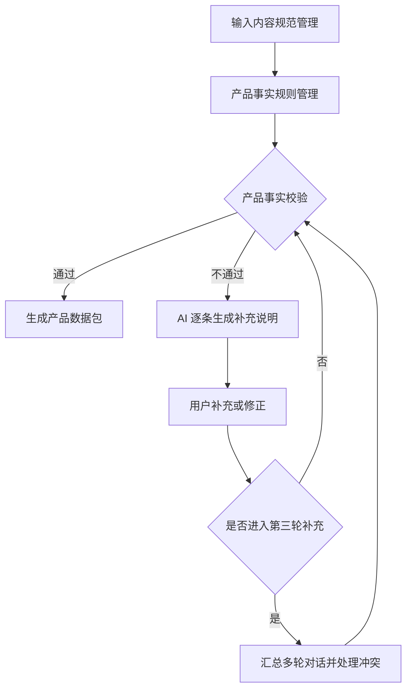
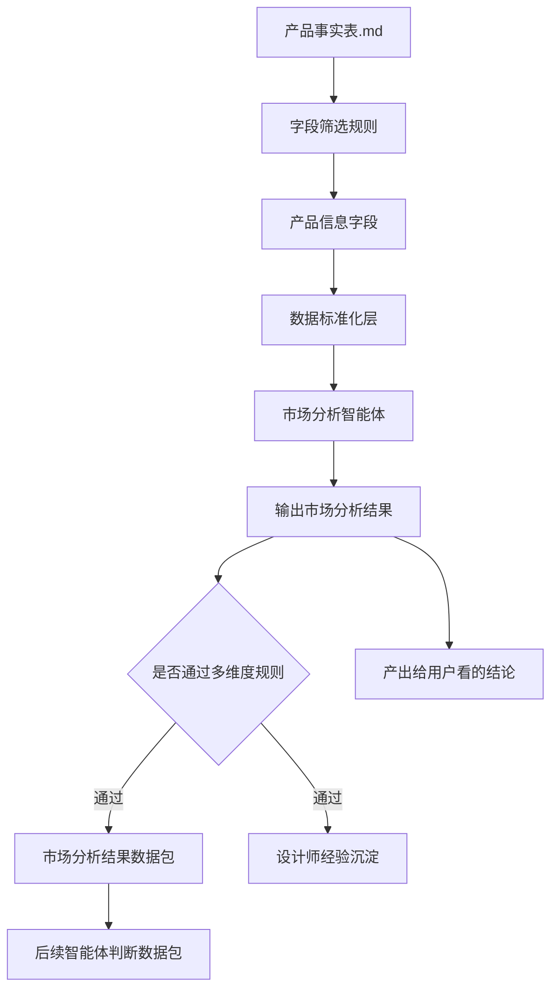
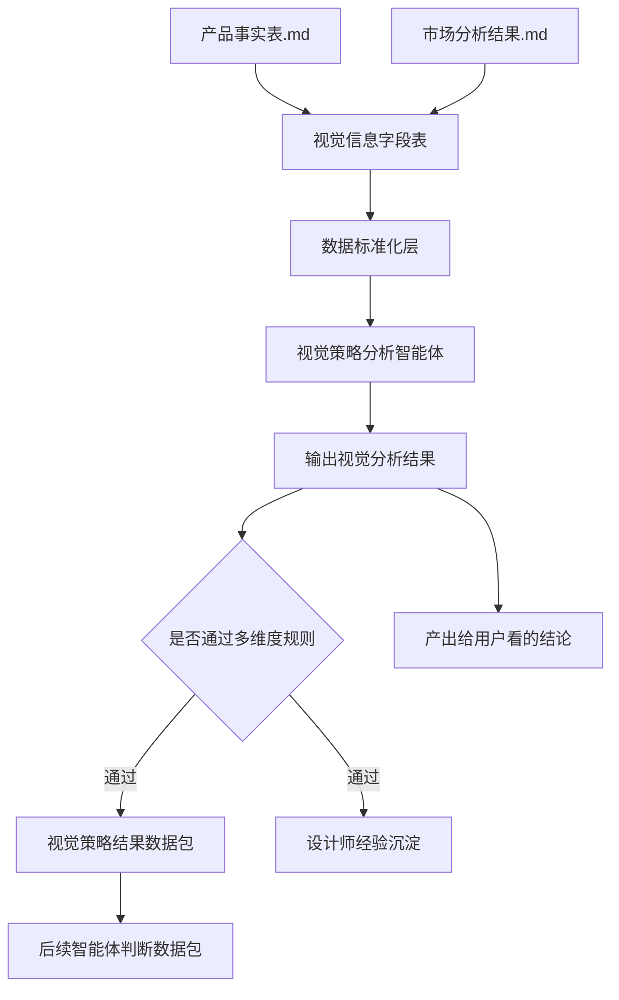
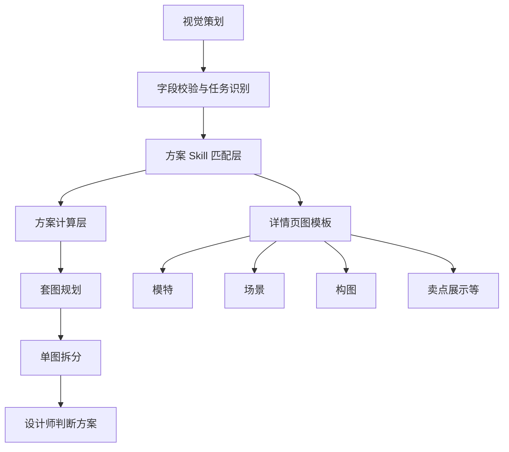

# 视觉跑图 AI 流程梳理稿 v0.1

本文基于《视觉跑图 AI 流程》docx 原文、表格和内嵌流程图整理。当前版本用于共同校对业务流程、智能体边界和后续 Markdown 定稿结构。

## 1. 文档目标

建立一套面向「视觉跑图」的 AI 业务系统流程，将产品事实、市场分析、视觉策略、视觉方案、ComfyUI 自动化跑图和人工审核连接成可执行链路。

该流程的核心目标不是单次生成图片，而是让 AI 在每一步都能明确：

- 读取哪些输入；
- 调用哪些规则、Skill 或工作流；
- 产出哪些结构化结果；
- 哪些情况必须回退、追问或转人工；
- 如何把上游结论稳定传递给下游。

## 2. 整体架构

原文提到「视觉 AI 系统六大核心能力模块」，但图中可稳定识别为 5 个核心能力模块加 1 个人工处理节点：

| 层级 | 模块 | AI 形态 | 数据库或规则形态 | 主要产物 |
| --- | --- | --- | --- | --- |
| 核心能力层 | 产品事实理解 | 规则 + 多模态判断能力调用 | 产品事实字段表、产品事实匹配规则、触发词 prompt | 产品数据包 |
| 核心能力层 | 市场用户分析 | 智能体 + 品类维度单品 Skill | 单品维度 Skill 注册表、单品 Skill、Skill 匹配规则、智能体边界设定、输入输出规范 | 市场分析结果数据包 |
| 核心能力层 | 视觉策略输出 | 规则 + 多模态判断能力调用 | 视觉策略输出方案、关键词管理 | 视觉策略结果数据包 |
| 核心能力层 | 视觉方案规划 | 智能体 + 品类维度单品 Skill | 排版与模板规范、单品维度 Skill 注册表、单品 Skill | 视觉方案、套图规划、单图拆分 |
| 核心能力层 | ComfyUI 自动化链路 | 规则 + 工作流 | 单场景工作流，例如品类换装工作流 | AI 生成素材 |
| 人工节点 | 人工校验 / 审核 / 返回 | 人工审核 | 审核规则、修图规则、返工规则 | 通过稿或返修意见 |

待确认：是否要把「人工校验 / 审核 / 返回」计入「六大核心能力模块」，还是将「六大」修正为「五大核心能力模块 + 人工审核节点」。

## 3. 端到端业务流程

### 3.1 角色泳道

| 角色 | 主要职责 |
| --- | --- |
| 业务负责人 | 明确项目目标、补充品类状态与产品范围、发起审核、确认关键目标。 |
| 视觉策划 / 视觉策略 | 接收项目需求，输出产品定位、视觉目标、视觉策略和测试方案。 |
| AI 视觉设计师 | 评估 AI 能力与技术可行性，确认所需资源和周期，制定技术实施方案，执行智能体和 ComfyUI 相关任务。 |
| 修图师 / 设计执行 | 根据审核结果补充优化、细节调整和局部修图，提交修改稿。 |

### 3.2 主流程



说明：上图中的「调用 Figma 年终技法」来自原图节点，文字可能存在识别误差，需确认实际含义。

## 4. 模块 1：产品事实判断规则

### 4.1 模块定位

产品事实判断规则负责把用户输入、产品资料和业务资料校验为标准化产品数据包。它是后续市场分析、视觉策略和跑图链路的基础。

### 4.2 输入

- 用户输入；
- 产品数据包或产品事实表；
- 品牌手册；
- 市场分析数据包；
- 竞品报告；
- 业务需求中的渠道与交付要求。

### 4.3 字段提取规则

搭建阶段需要定义：

| 规则项 | 需要补充的内容 |
| --- | --- |
| 产品事实来源 | 从产品数据包提取哪些产品事实。 |
| 用户结论来源 | 从市场分析数据包提取哪些用户结论。 |
| 视觉特征来源 | 从竞品报告提取哪些视觉特征。 |
| 品牌规范来源 | 从品牌手册提取哪些硬性规范。 |
| 渠道与交付要求 | 从业务需求中提取哪些渠道与交付要求。 |
| 字段冲突优先级 | 同一字段存在多个结论时如何取舍。 |
| 字段标记 | 如何区分事实字段和 AI 推断字段。 |
| 缺失处理 | 信息缺失时是否允许继续生成策略。 |
| 人工确认 | 哪些字段必须由设计师确认。 |
| 下游传递 | 视觉策略字段如何传递给下游智能体。 |

### 4.4 运算逻辑



### 4.5 产品事实校验状态

| 状态 | AI 动作 | 输出 | 下一节点 |
| --- | --- | --- | --- |
| 通过 | 生成标准化产品数据包。 | 产品数据包。 | 进入后续业务流程。 |
| 待补充 | 逐条列举缺失、错误或冲突信息。 | 补充说明。 | 退回用户补充或修正。 |
| 多轮补充中 | 记录每轮原始输入与补充内容，重新执行完整性校验。 | 补充记录。 | 最多 3 轮后汇总。 |
| 冲突待确认 | 汇总第 1-3 轮有效信息，清理重复或无效内容。 | 冲突字段清单。 | 回滚至对应字段重新确认。 |

### 4.6 需要补充的规则

| 规则组 | 需要补充的内容 |
| --- | --- |
| 输入内容规范管理 | 输入资料来源范围、各来源可信度与优先级、必填字段与选填字段、字段名称和格式、文件要求、不同品牌或品类字段差异、资料版本管理方式。 |
| 产品事实判断规则 | 字段完整性、格式正确性、真实性依据、一致性规则、冲突优先级、模糊描述识别、异常数据识别、AI 推断边界、转人工条件、通过标准。 |
| 补充追问规则 | 必须追问字段、可跳过字段、追问模板、单轮追问数量、填写示例、无效提交处理方式、最大补充轮次。 |
| 多轮对话管理规则 | 每轮记录方式、新旧信息合并、去重、覆盖、冲突确认、1-3 轮汇总方式、超轮次处理、转人工触发条件、人工确认后的回滚节点。 |
| 产品数据包生成规则 | 字段结构、数据格式、覆盖的下游流程、不同任务的数据包差异、已确认和待确认字段标记、信息来源和更新时间、禁止修改项和风险项、命名与版本、下游调用接口。 |

## 5. 模块 2：市场分析智能体

### 5.1 模块定位

市场分析智能体基于产品事实字段，完成市场用户分析、品类维度分析、单品维度分析和竞品分析，产出市场分析结果数据包，并为后续视觉策略提供判断依据。

### 5.2 流程转写



### 5.3 数据架构

| 层级 | 需要定义的内容 |
| --- | --- |
| 字段层 | 市场分析所需字段、字段来源及优先级、字段提取方法、字段标准化规则、缺失与冲突处理规则。 |
| Skill 层 | 品类分析方法、单品分析方法、用户需求分析方法、价格带分析方法、趋势分析方法、渠道分析方法、各 Skill 标准输出模板。 |
| 竞品层 | 竞品分类标准、竞品筛选规则、产品拆解方法、视觉拆解方法、竞品评分规则、竞品分析标准模板。 |
| 计算层 | 核心指标定义、数据计算方法、指标权重、分数分级标准、数据不足时的处理规则、权重迭代与校准方式。 |
| 大模型层 | 综合分析方法、事实引用规则、结论生成规则、置信度规则、AI 推断边界、人工确认条件、结果字段与输出格式。 |

### 5.4 当前缺口

- 权重设计仅有提示，缺少指标、权重、计算公式和校准方式。
- 「市场分析 Skill 需要从哪些角度出发」仍是问题句，需要固化为可执行分析清单。
- 标准分析模板未给出，AI 无法稳定判断市场分析是否完成。
- 竞品分析方法和竞品评分规则未定义。
- 「产出给用户看的结论」和「后续智能体判断数据包」的字段差异未定义。

## 6. 模块 3：视觉策略智能体

### 6.1 模块定位

视觉策略智能体承接产品事实数据包、市场用户分析结果、竞品分析结果、品牌视觉规范、渠道与业务任务，生成可供视觉方案规划和跑图执行使用的策略数据包。

### 6.2 必须回答的问题

| 问题 | 用途 |
| --- | --- |
| 这个产品最应该向谁表达？ | 明确目标用户。 |
| 用户为什么会购买这个产品？ | 明确购买动机。 |
| 用户购买前最大的顾虑是什么？ | 明确需要消除的风险感。 |
| 产品最值得优先表达的卖点是什么？ | 明确视觉主信息。 |
| 哪些卖点能够通过图片直接证明？ | 判断视觉表达可行性。 |
| 竞品正在采用什么视觉方式？ | 建立参考与避开范围。 |
| 本产品应该参考什么、避开什么？ | 确定差异化方向。 |
| 本产品可以占据什么差异化视觉位置？ | 输出视觉策略定位。 |
| 不同渠道应该如何调整视觉重点？ | 支持渠道差异化交付。 |
| 后续需要生成哪些类型的图片？ | 传递给视觉方案规划。 |

### 6.3 流程转写



### 6.4 硬规则

视觉策略必须遵守以下硬规则：

- 产品结构不得被错误修改；
- 产品颜色、图案、Logo 不得随意变化；
- 品牌禁用项不得出现；
- 渠道合规要求不得违反；
- 无事实依据的功能不得被视觉化；
- 未经确认的产品卖点不得作为核心策略。

### 6.5 当前缺口

- 「视觉策略结果数据包」字段未定义。
- 「多维度规则」缺少可执行判断标准。
- 「设计师经验沉淀」的写入格式、复用条件和审核机制未定义。
- 原文中有「以上为案例，实际策略需要根据需求案例反推」，但未提供反推方法和示例。
- 硬规则缺少违规检测方式和失败后的回退动作。

## 7. 模块 4：视觉方案规划

原文第 4 节标题仍写为「视觉方案智能体」，但内容指向「解决具体制作哪些图片、怎么排版、如何呈现」。建议将该模块命名为「视觉方案规划智能体」，以区分第 3 节的「视觉策略智能体」。

### 7.1 模块定位

视觉方案规划负责把视觉策略转换为具体图片清单、版式结构、模板选择、套图规划和单图拆分规则。

### 7.2 流程转写



### 7.3 当前缺口

- 「可用框架」未定义，例如详情页图、主图、场景图、对比图、功能证明图等。
- 「方案 Skill 匹配层」缺少匹配条件。
- 「方案计算层」缺少计算指标和决策规则。
- 「套图规划」和「单图拆分」缺少输出模板。
- 与 ComfyUI 跑图管线之间的交接字段未定义。

## 8. 模块 5：ComfyUI 自动化跑图管线

原文只有章节标题，尚未展开。

建议补齐以下内容：

| 项目 | 需要定义的内容 |
| --- | --- |
| 触发条件 | 哪些视觉方案可以进入 ComfyUI 自动化生成。 |
| 输入字段 | 视觉策略、图型、构图、风格、产品约束、品牌禁用项、渠道尺寸、参考图、种子图、模型参数。 |
| 工作流选择 | 如何从 ComfyUI 工作流数据库选择对应工作流。 |
| Prompt 生成 | 正向 prompt、反向 prompt、结构化约束、禁止项。 |
| 批量生成 | 单图生成数量、采样参数、重跑条件。 |
| 自动审核 | 结构一致性、品牌合规、画面完整性、卖点呈现、文字错误、产品变形。 |
| 人工审核 | 哪些失败类型必须转人工。 |
| 输出 | 图片文件、参数记录、生成日志、审核结果、返修意见。 |

## 9. 数据库管理

原文列出 3 类数据库：

| 数据库 | 作用 | 建议补充字段 |
| --- | --- | --- |
| 产品事实字段数据库 | 管理产品事实、字段格式和校验规则。 | 字段名、字段类型、是否必填、来源优先级、校验规则、示例、下游使用方。 |
| ComfyUI 工作流数据库 | 管理不同场景的生成工作流。 | 工作流名称、适用品类、适用图型、输入参数、输出文件、失败处理、版本。 |
| 竞品数据库 | 管理竞品素材和分析结果。 | 竞品品类、渠道、素材链接、视觉特征、卖点表达、评分、更新时间。 |

## 10. Skill 文件结构建议

原文给出的 Skill 结构可保留：

```text
skill-name/
├── SKILL.md
├── scripts/
├── references/
├── resources/
└── examples/
```

建议每个核心模块都按以下结构拆成独立 Skill：

| Skill | 建议职责 |
| --- | --- |
| product-fact-validator | 校验产品事实、追问缺失字段、生成产品数据包。 |
| market-analysis-agent | 执行市场、用户、品类、单品和竞品分析，生成市场分析结果数据包。 |
| visual-strategy-agent | 基于产品事实和市场分析生成视觉策略结果数据包。 |
| visual-plan-agent | 把视觉策略转换为套图规划、单图拆分和版式方案。 |
| comfyui-pipeline-agent | 根据视觉方案选择 ComfyUI 工作流，生成图片并记录参数。 |
| visual-review-agent | 对生成图进行自动检查，输出通过、返修或人工审核意见。 |

## 11. AI 可执行性审阅

| 级别 | 位置 | 问题 | 影响 | 建议 |
| --- | --- | --- | --- | --- |
| 阻塞级 | 整体架构 | 「六大核心能力模块」与图中 5 个模块加人工节点不一致。 | AI 无法稳定拆分 Skill 数量和职责边界。 | 明确模块数量和命名。 |
| 阻塞级 | 模块 2-5 | 多处仍为「需要定义」「需要补充」「案例？？？」。 | AI 只能理解方向，不能稳定执行。 | 为每个模块补齐输入字段、输出字段、判断规则和示例。 |
| 阻塞级 | ComfyUI 自动化跑图管线 | 只有标题，没有执行流程。 | 无法从视觉方案进入自动化跑图。 | 补充工作流选择、Prompt 生成、批量生成、审核和返修规则。 |
| 风险级 | 完整业务流程图 | 多个回退箭头和「不通过」分支未在正文解释。 | AI 可能回退到错误节点或重复执行。 | 建立状态转移表，明确每个失败类型的回退节点。 |
| 风险级 | 市场分析智能体 | 权重设计未定义。 | 输出结论可能不稳定，难以复现。 | 定义指标、权重、计算公式和置信度。 |
| 风险级 | 视觉策略智能体 | 硬规则只有示例，缺少检测方法。 | 生成策略可能违反产品或品牌约束。 | 为每条硬规则定义检测字段、失败条件和处理动作。 |
| 优化级 | 术语 | 「视觉方案智能体」在第 3 节和第 4 节重复出现。 | 阅读时容易混淆策略与方案。 | 第 3 节命名为「视觉策略智能体」，第 4 节命名为「视觉方案规划智能体」。 |
| 优化级 | Skill 参考章节 | Skill 模板可用，但未映射到本业务模块。 | 后续落地时还需再次拆解。 | 直接把 6 个建议 Skill 套入模板。 |

## 12. 待确认问题

1. 「六大核心能力模块」是否应定义为：产品事实理解、市场用户分析、视觉策略输出、视觉方案规划、ComfyUI 自动化链路、人工审核？
2. 第 4 节是否应从「视觉方案智能体」改名为「视觉方案规划智能体」？
3. 产品事实数据包、市场分析结果数据包、视觉策略结果数据包是否需要分别输出为 `.md`、`JSON`，还是两者都要？
4. 「产品事实校验」最多 3 轮补充后，如果仍不通过，是终止、转人工，还是允许有条件通过？
5. 市场分析的权重是否需要在第一版中落地，还是先用「强规则 + 人工审核」过渡？
6. ComfyUI 管线当前是否已有工作流数据库或示例工作流？如果已有，Markdown 定稿应引用具体工作流字段。
7. 「调用 Figma 年终技法」是否为原文正式节点？如果不是，需要改成实际工具或动作名称。
8. 人工审核的通过标准是否已有内部规范？如果没有，需要新增「审核检查清单」。

## 13. 建议下一步

先确认第 12 节的 8 个问题。确认后，第二版可以继续生成：

- 端到端流程定稿；
- 每个 Skill 的 `SKILL.md` 草案；
- 每个数据包的字段模板；
- ComfyUI 跑图管线的执行清单；
- 人工审核检查清单。
